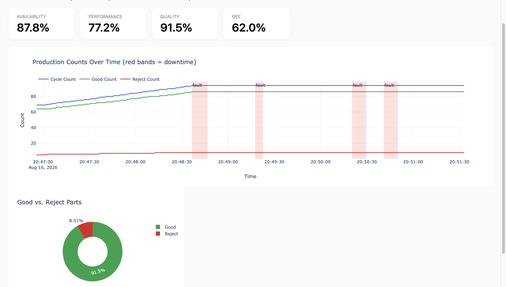

# PLC-to-Cloud OEE Monitor

A simulated production line controlled by real PLC ladder logic, streamed over
Modbus TCP into a Python data pipeline, and visualized as a live OEE
(Overall Equipment Effectiveness) dashboard.

This project was built to demonstrate the full IT/OT integration stack used
in real manufacturing retrofits: PLC control logic → industrial connectivity
→ data pipeline → analytics → dashboard.



## Architecture

```
┌─────────────────┐      Modbus TCP       ┌──────────────┐
│  simulator.py    │ ─────writes coils───▶ │              │
│  (drives the     │                       │  OpenPLC     │
│   simulated       │                       │  Runtime     │
│   process)        │ ◀────reads state───── │  (ladder     │
└─────────────────┘                       │   logic)     │
                                            └──────┬───────┘
┌─────────────────┐      Modbus TCP               │
│   logger.py       │ ◀──────reads all────────────┘
│  (polls & logs     │
│   to SQLite)        │
└────────┬────────┘
         │
         ▼
┌─────────────────┐      ┌──────────────────┐
│   oee_data.db    │ ───▶ │  oee_calculate.py │
│    (SQLite)       │      │  dashboard.py      │
└─────────────────┘      └──────────────────┘
```

- **PLC logic** (OpenPLC Editor, Ladder Diagram): start/stop control with a
  seal-in circuit, a latched fault system (jam + e-stop interlock), cycle/
  good/reject counting, and downtime timing.
- **Runtime**: OpenPLC Runtime v4, running in Docker, executing the compiled
  program and exposing state over Modbus TCP.
- **Simulator**: stands in for physical sensors and pushbuttons, since there's
  no real hardware — feeds simulated parts through the line, with occasional
  rejects and jams.
- **Logger**: polls every exposed coil/register once a second and logs
  timestamped readings to SQLite. Read-only — never writes to the PLC.
- **Analytics**: Availability, Performance, and Quality are computed from the
  logged data, not inside the PLC (see *Design Decisions* below).
- **Dashboard**: a self-contained Plotly Dash app, auto-refreshing, showing
  live KPIs, a production timeline with downtime shading, and a quality
  breakdown.

## Tech stack

- **OpenPLC Editor v4** — ladder diagram programming (IEC 61131-3)
- **OpenPLC Runtime v4** (Docker) — PLC execution + Modbus TCP server
- **Python** — `pymodbus`, `pandas`, `dash`, `plotly`
- **SQLite** — time-series data store

## Setup & reproduction

### 1. PLC Runtime

```bash
docker run -d \
  --name openplc-runtime \
  -p 8443:8443 \
  -p 502:502 \
  --cap-add=SYS_NICE \
  --cap-add=SYS_RESOURCE \
  -v openplc-runtime-data:/var/run/runtime \
  ghcr.io/autonomy-logic/openplc-runtime:latest
```

### 2. Deploy the ladder program

Open the project in OpenPLC Editor, connect to the Runtime (`localhost`),
and use **Build and upload**.

### 3. Install Python dependencies

```bash
pip install -r requirements.txt
```

### 4. Run the pipeline

In three separate terminals, started close together:

```bash
python3 logger.py      # starts logging to oee_data.db
python3 simulator.py   # starts driving the simulated process
python3 dashboard.py   # open http://127.0.0.1:8050
```

Let it run for a few minutes to gather enough data for a meaningful OEE
calculation, then stop the simulator, then the logger.

### 5. Calculate OEE from a completed run

```bash
python3 oee_calculate.py --ideal-cycle-time 2.0
```

## Modbus address map

| Variable | Address | Type |
|---|---|---|
| Machine_Running | Coil 0 | R/W |
| Machine_Faulted | Coil 1 | R/W |
| Reject_Gate | Coil 2 | R/W |
| Conveyor_Motor | Coil 3 | R/W |
| Fill_Actuator | Coil 4 | R/W |
| Fault_Lamp | Coil 5 | R/W |
| Start_PB | Coil 8 | R/W |
| Stop_PB | Coil 9 | R/W |
| EStop_OK | Coil 10 | R/W |
| Jam_Sensor | Coil 11 | R/W |
| Part_Present | Coil 12 | R/W |
| Reject_Sensor | Coil 13 | R/W |
| Reset_PB | Coil 14 | R/W |
| Cycle_Count | Holding Reg 0 | R/W |
| Good_Count | Holding Reg 1 | R/W |
| Reject_Count | Holding Reg 2 | R/W |

Verified against the running Runtime with `modbus_verify.py`.

## Design decisions

**Downtime is calculated in Python, not in the PLC.** The ladder logic times
faults internally (`TON`), but rather than exposing that elapsed time as a
Modbus tag and accumulating a running total inside the PLC, `Machine_Faulted`
transitions are logged with timestamps and downtime is derived in the
analytics layer. This mirrors how real OEE systems are typically built:
the PLC focuses on control, and the historian/analytics layer owns
aggregation — which is more flexible (per-shift totals, per-cause
breakdowns, etc. can all be added later without touching ladder logic).

**Simulated sensors are writable Modbus coils, not read-only discrete
inputs.** Since there's no physical hardware, pushbuttons and sensors
(`Start_PB`, `Jam_Sensor`, etc.) are addressed as coils so `simulator.py`
can drive them. In a real deployment these would be wired to physical
inputs instead.

## What I debugged

- **A cross-rung counting bug**: `Cycle_Count` correctly gated on
  `Machine_Running`, but `Good_Count`/`Reject_Count` didn't — after a fault
  and restart, the counters could drift out of sync
  (`Good + Reject != Cycle`). Fixed by adding the same interlock to both
  counters, and updated the simulator to actually re-press Start after a
  jam clears rather than assuming it.
- **PLC scan-cycle overruns causing missed sensor edges**: the default
  20ms task period was being badly overrun (up to ~180ms in this Docker
  environment), which meant short (200ms) simulated input pulses
  occasionally landed entirely within a single slow scan and were never
  registered. Root-caused via the Runtime's scan cycle statistics, fixed
  by relaxing the task period to 100ms and lengthening the pulse duration
  in the simulator.
- **Stale/mixed session data**: an early dashboard reading looked wrong
  (very low Performance) because the database contained a long idle tail
  from a previous session mixed with a real run. Fixed by ensuring
  logger/simulator sessions are run cleanly and the database is cleared
  between test runs.

## Possible extensions

- Real hardware sensor node (see companion idea: retrofit sensor via
  ESP32 + custom PCB) feeding into the same pipeline
- Digital twin of the same process in AnyLogic, validated against this
  logged data
- Predictive maintenance / anomaly detection on cycle-time drift
